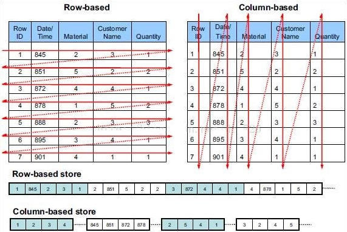
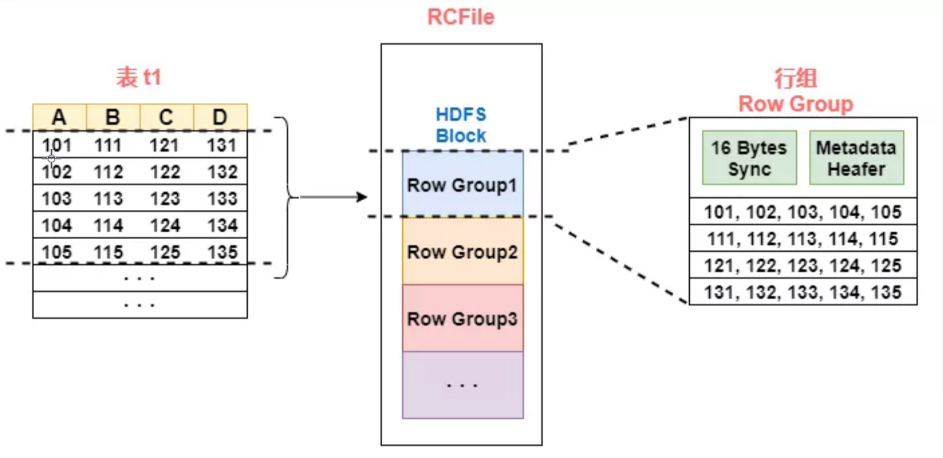
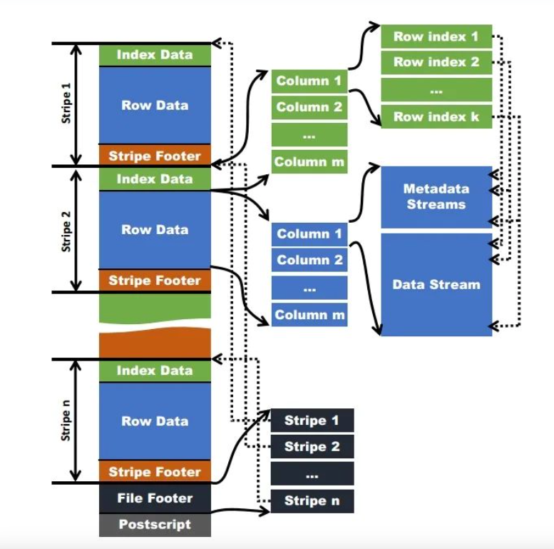
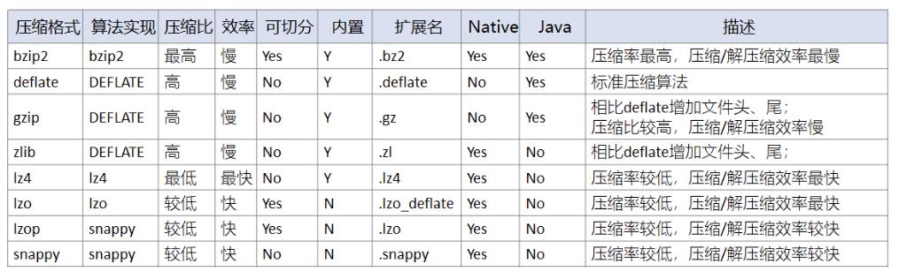

# 行存储/列存储
存储格式一共分两个大类,行存储(Row-Based)和列存储(Column-Based),可以看如下图片直观看到行存储和列存储两者存储的区别



行存储 : 

+ 含义 : 数据按照行为单元进行存储,一行的数据都是放到一起的,传统的关系型数据库都是这么存储的
+ 优点 : 
    - 数据被保存到一起,更容易insert和update
    - 行存储数据都是写到一起,所以磁头调度少,**写入效率高**
    - 适合高qps的点查询
+ 缺点 : 
    - 即使查询某几列,整行的数据也会被读取
    - 因为一行的数据类型不一样,所以压缩比较低
+ 适用场景 : 更适合高频写入和更新的事务型场景,比如mysql,但是这种一般不会数据量很大,因为对于查询需求如果数据量很大就意味着要扫描大量的数据并且要维护极大的索引数据,而且延迟也会上升,关系型数据库一般都是在1千万数据量以下,再多的话就会考虑分库分表或者改用其他存储引擎

列存储 : 

+ 含义 : 数据按照列为单元进行存储,一列的数据被放到一起,一般分析性数据库都是按照这么存储的
+ 优点 : 
    - 查询某些列仅读取这些列的数据,读取效率较高,IO较低
    - 一列的数据类型一样,通常来说压缩比较高
    - 适合高吞吐场景
+ 缺点 : 
    - insert/update 比较麻烦
    - 列存储需要把一行数据拆分多列写入,磁头调度多,写入效率不如行存储
+ 适用场景 : 更适合大数据量的存储及分析型场景,因为一般对于分析场景类说,仅会关心其中的几列数据,读取其他列的数据没有太大作用,而且一般来讲列存储的压缩率很大,很适合存储大量数据


在存储中还有一种方案是**行列混存**,就是先按照行进行切块,然后再按照列进行存储

# 存储格式
Hive有如下几种存储格式 : 

+ textfile(默认格式)
+ sequencefile
+ rcfile
+ orc
+ parquet
+ avro


几种类型的建表语句

```sql
--textfile文件格式
CREATE TABLE `test_textfile`(`id` STRING,`name` STRING)
ROW FORMAT DELIMITED FIELDS TERMINATED BY ',' STORED AS textfile;
--sequencefile文件格式
CREATE TABLE `test_sequence`(`id` STRING,`name` STRING)
ROW FORMAT DELIMITED FIELDS TERMINATED BY ',' STORED AS sequencefile;
--parquet文件格式
CREATE TABLE `test_parquet`(`id` STRING,`name` STRING)
ROW FORMAT DELIMITED FIELDS TERMINATED BY ',' STORED AS parquet;
--orc文件格式
CREATE TABLE `test_orc`(`id` STRING,`name` STRING)
ROW FORMAT DELIMITED FIELDS TERMINATED BY ',' STORED AS orc;
--rcfile文件格式
CREATE TABLE `test_rc`(`id` STRING,`name` STRING)
ROW FORMAT DELIMITED FIELDS TERMINATED BY ',' STORED AS rcfile;
--avro文件格式
CREATE TABLE `test_avro`(`id` STRING,`name` STRING)
ROW FORMAT DELIMITED FIELDS TERMINATED BY ',' STORED AS avro;
```


先在这里提前说明一个很多文章都会出现的一个误区,就是是否可切分的问题,可切分就代表着任务可以并行执行,如果不可切分可能会导致map端的数据倾斜,因为所有的数据都会到一个map上去处理.

是否可切分由两个因数决定 : 

一.文件格式(textfile,sequencefile,rcfile,orc,parquet,avro) 

二.压缩类型(bzip2,deflate,gzip,zlib,lz4,lzo,lzop,snappy)


优先由文件格式决定,比如orc格式支持的三种压缩模式(none,lzo,snappy),其中lzo和snappy这两种压缩算法都是不支持切分的,但是因为是orc格式,所以最后文件还是可以切分的,因为压缩仅是压缩了数据域,没有把header这种元信息压缩了,所以读取数据的时候还是可以通过头部信息找到对应数据的.如果说把这种头部信息也压缩了,那么只能是将所有数据都读取放到一个map执行,这种就是不可以切分的.

所以总的来说 : 是否可切分最直接的原因就是是否可以通过元信息直接的找到需要的数据


文章最后会做一个哪些是可切分,哪些是不可切分的总结~


## textfile
建表语句 : 

```sql
CREATE TABLE `test_textfile`(`id` STRING,`name` STRING)
ROW FORMAT DELIMITED FIELDS TERMINATED BY ',' STORED AS textfile;
```

特点 : 

+ 行存储
+ textfile 是 hive的默认存储格式,如果不指定,默认就是这种
+ 数据是直接明文存储到hdfs上的,可以直接cat来查看
+ 建表的时候需要指定分隔符,可以使用任意分隔符来对列进行分割
+ 不会对文件进行压缩,数据加载较快,但是也因此会更占用存储
+ 可以使用Gzip和Bzip2对数据进行压缩,但是Gzip压缩后数据不可以进行切分(Bzip2可切分),会影响读取性能

优缺点 : 

+ 优点 : 
    - 可使用cat查看
    - 加载速度最快 : 可以直接使用load导入数据,其他格式不可以使用load,
+ 缺点 : 
    - 占用磁盘大 : 因为是行存储,默认不开启压缩
    - IO性能低 : 因为是行存储
    - Gzip压缩后无法切分 : 无法切分会导致单个map任务处理数据太大
    - 反序列化开销大 : 反序列化必须逐个判断分隔符和行结束符


## sequencefile
建表语句 : 

```sql
-- 设置压缩格式为块压缩
set mapred.output.compression.type=BLOCK;
-- 建表
CREATE TABLE `test_sequence`(`id` STRING,`name` STRING)
ROW FORMAT DELIMITED FIELDS TERMINATED BY ',' STORED AS sequencefile;
```

特点 : 

+ 行存储
+ sequencefile是hadoop api提供的一种二进制文件格式
+ 内容以kv对象来组织
+ 可压缩可切分 : 有三种压缩选择,一般使用block
    - none(无压缩) : 如果没有启用压缩,默认是none,每个记录是由4部分组成 : 键长度,记录长度,键,值组织,长度字段为4字节
    - record(记录压缩) : 和无压缩的组成基本相同,但是会对每条记录的值进行压缩,注意 : 键是不压缩的
    - block(块压缩) : 块压缩是一次性压缩多个记录,当记录的字节数达到阈值才会添加到块中,该值由`io.seqfile.compress.blocksize` 来定义,默认1000000字节,由5部分组成 : 记录数,键长度,值长度,键,值.因为record压缩率低,所以一般使用block压缩

优缺点 : 

+ 优点 : 
    - 使用方便
    - 可压缩可分割
+ 缺点 : 
    - kv格式,比源文本格式占用磁盘更多,一般生产不会使用


## rcfile
全称 : Record Columnar File

建表语句 : 

```sql
CREATE TABLE `test_rc`(`id` STRING,`name` STRING)
ROW FORMAT DELIMITED FIELDS TERMINATED BY ',' STORED AS rcfile;
```


特点 : 

+ 行列混存,先按行分组,然后再列存储(先水平划分,后垂直划分)
+ RcFile文件格式是 FaceBook 开源的一种文件存储格式
+ 懒加载 ; 数据存储都是压缩的,读取的时候进行解压,而且仅会对使用到的数据进行解压
+ 一个hdfs块可以有一个或者多个行组
+ 不支持数据更新,只支持覆盖和追加
+ 可切分,使用游程编码压缩


优缺点 : 

+ 优点 : 
    - 压缩率高 : 行划分,列存储,游程编码,节省了很大的存储空间
    - 懒加载 : 读取的时候解压,仅解压需要的字段
+ 缺点 : 
    - 每个行组的默认大小是4MB,相对于orc不是很高效
    - orc是rcfile的升级版,在很多方面进行了优化,所以**一般生产上不会用rcfile**


rcfile文件格式 : 

+ 16字节的hdfs同步块信息 : 主要为了区分hdfs块上的相邻行组
+ 元数据头部信息 : 存储的行数,列的字段信息等
+ 数据部分 : 将一列存储为一行,使用的时候可以仅取出其中一列,而且压缩比高,读取快




## orc
全称 : Optimized Record Columnar

建表语句 : 

```sql
CREATE TABLE `test_orc`(`id` STRING,`name` STRING)
ROW FORMAT DELIMITED FIELDS TERMINATED BY ',' STORED AS orc;
```

特点 : 

+ 列存储(但并不是单纯的列存,会首先按行水平切分,然后再按列存储)
+ orc 是在rcfile的基础上进行了一定的改进
+ 支持三种压缩选项 : None,Zlib,Snappy 默认是Zlib
+ Zlib压缩率比Snappy高,但是速度Snappy快,一般生产使用Snappy
+ hive 建事务表需要指定为orc
+ orc拓展了rcfile的压缩,除了游程编码,还引入了字典编码和Bit编码
+ 序列化的时候可以根据类型进行序列化,而rcfile是一种序列化方式,比rcfile更高效
+ 支持多种数据类型,比如datetime,decimal和复杂的数据类型(struct,array,map)
+ ORC的stripe默认大小更大,为ORC writer提供了一个memory manager来管理内存使用情况
+**可以切分 (和压缩格式无关!!!)**


优缺点 : 

+ 优点 : 
    - 可切分
    - 支持多种数据类型及复杂数据类型
    - orc拓展了rcfile的压缩,除了游程编码,还引入了字典编码和Bit编码
    - 序列化的时候可以根据类型进行序列化,而rcfile是一种序列化方式,比rcfile更高效
    - ORC的stripe默认大小更大,为ORC writer提供了一个memory manager来管理内存使用情况
    - 查询性能高,内置了很多的索引
+ 缺点 : 
    - 不可以使用load导入
    - 虽然支持一些复杂数据类型,对于一些嵌套式数据(json,protoclobuffer,thrift)不支持
    - 对schema演化支持比较差


orc文件格式 : 



组成 : 

+ Stripe
    - 数据会被按行切分成多个Stripe,每个Stripe默认大小是250M
    - 大小一般是HDFS块的大小或者比HDFS块小一点,这样存储的优势就是一个stripe不会分别存储到两个块上,从而导致跨服务器的远程数据读取
    - 组成
        * index data(索引) : 该stripe的索引信息,也包含了两类,统计索引和位置索引,统计索引一些count,sum,max,min等值,帮助跳过一些不必要的读取,位置索引就是帮助快速定位到数据的起始位置
        * row data(数据) : 包含了元数据流,和数据流,源数据流报错了每个row group的位置和统计信息,数据流包含了多种数据类型的数据
        * stripe footer(元数据) : stripe的一些元数据信息,包含了一些统计信息和schema信息
+ File Footer
    - 页脚信息包含了所有Stripe的描述信息,包括每个stripe的行数,每个列的数据类型,也包含了每个列的 count,min,max,sum等信息
+ Postscript
    - 在附言中包含了压缩参数和压缩页脚的大小


统计信息 : 

orc包含三个层级的统计信息,文件级别,stripe级别,row group级别,根据这些信息实现维词下推来减少不必要的数据读取.

+ 文件级别 : 记录整个文件级别的columns统计信息,帮助查询的优化和快速返回一些信息,比如count,max,min等
+ stripe级别 : 和文件级别存储的信息类似,只不过是保存的单个stripe的统计信息
+ row group 级别 : 为了更细粒度的跳过不必要处理的的新,一个stripe又被切割成了多个row group,默认是1万个值,这的统计信息可以帮助跳过更细粒度不必要处理的数据.

## parquet
建表语句 : 

```sql
CREATE TABLE `test_parquet`(`id` STRING,`name` STRING)
ROW FORMAT DELIMITED FIELDS TERMINATED BY ',' STORED AS parquet;
```

特点 : 

+ 列存储
+ 由 Twitter 和 Cloudera 合作开发,灵感是来自于2010 年 Google 发表的 Dremel 论文
+ 最大的特点是支持嵌套格式(Nested Data)的列式存储
+ 跨平台 : 和计算框架,数据模型,编程语言无关,可以与任意项目集成
+ 支持多种压缩算法 : Snappy Gzip LZO Delta
+ 支持多种列存编码方式 : RLE DElta Bit Packing等
+ 支持 Schema Evolution,可以在不破坏数据完整性的前提下升级和演进数据模式
+ 自解析 : parquet文件包含元数据文件,可以监控数据读取和解析速度

优缺点 : 

+ 优点 : 
    - 跨平台
    - 支持嵌套格式数据的列式存储
    - 支持多种压缩和编码方式
+ 缺点 : 
    - 列存,所以写入性能较慢,适合批量写入
    - 更适合批处理场景,不太适合实时场景
    - 不支持update和ACID

## avro
建表语句 : 

```sql
CREATE TABLE `test_avro`(`id` STRING,`name` STRING)
ROW FORMAT DELIMITED FIELDS TERMINATED BY ',' STORED AS avro;
```

特点 : 

+ 跨平台,和语言无关
+ 行存储
+ 模式演变更成熟,支持添加或者修改列,而parquet仅支持追加
+ schema信息json存储,数据二进制存储

优缺点 : 

+ 优点 : 
    - 最大的优点就是对模式演化的支持
+ 缺点 : 
    - 行存储,相对于列存储吞吐量低
    - 生产上一般不用这种类型,因为一般都是使用列存储

## 总结
| 存储格式 | 行存储/列存储 | 是否可分割 | 最大亮点 | 生产中常用指数 |
| --- | --- | --- | --- | --- |
| textfile | 行 | 不压缩就可以分割/压缩后取决于压缩方式是否可分割 | 可以通过load导入,可视化读 | ⭐⭐⭐⭐️ |
| sequencefile | 行 | 可分割 | 可压缩可分割 | ⭐ |
| rcfile | 行列混存 | 可分割 | 行列混存,先行分割,后列存储 | ⭐ |
| orc | 列 | 可分割 | 优化版rcfile,自带多种索引,查询更快 | ⭐⭐⭐⭐⭐ |
| parquet | 列 | 可分割 | 支持嵌套数据的列存储 | ⭐⭐⭐⭐⭐ |
| avro | 行 | 和textfile一样 | json格式存储schema信息,对模式演进支持很强 | ⭐ |


一般最常用的就是textfile,orc和parquet

# 压缩格式


> 注意 : 这里的是否可切分和存储格式的可切分还有点区别,比如snappy本身是不可以切分的,但是如果是orc格式的,那么就会变成可切分了
>
> 决定可不可分，主要是看能不能有个清晰的规则支持从任意位置读数据
>

生产环境一般会采用 lz4,lzo,snappy压缩以保证高效运算.

使用本地库Native Libraries提供的压缩方式，性能上会有50%左右的提升。

使用命令可以查看native libraries的加载情况：

```sql
hadoop checknative -a
```

# 参考文章
[https://cwiki.apache.org/confluence/display/Hive/FileFormats](https://cwiki.apache.org/confluence/display/Hive/FileFormats)

[https://blog.csdn.net/weixin_49114503/article/details/134833643](https://blog.csdn.net/weixin_49114503/article/details/134833643)

[https://cloud.tencent.com/developer/article/1880494](https://cloud.tencent.com/developer/article/1880494)

[https://www.cnblogs.com/sx66/p/17940015](https://www.cnblogs.com/sx66/p/17940015)

[https://www.cnblogs.com/hyunbar/p/12527473.html](https://www.cnblogs.com/hyunbar/p/12527473.html)

[https://cloud.tencent.com/developer/article/1888531](https://cloud.tencent.com/developer/article/1888531)

[https://blog.csdn.net/dabokele/article/details/51542327](https://blog.csdn.net/dabokele/article/details/51542327)

[https://cloud.tencent.com/developer/article/1769601](https://cloud.tencent.com/developer/article/1769601)

[https://cloud.tencent.com/developer/article/1983913](https://cloud.tencent.com/developer/article/1983913)

[https://cloud.tencent.com/developer/article/1757862](https://cloud.tencent.com/developer/article/1757862)

[https://bbs.huaweicloud.com/blogs/282511](https://bbs.huaweicloud.com/blogs/282511)

[https://helloyoubeautifulthing.net/blog/2021/01/03/parquet-format/](https://helloyoubeautifulthing.net/blog/2021/01/03/parquet-format/)

[https://parquet.apache.org/docs](https://parquet.apache.org/docs)


