> 本文会将从环境搭建到demo来全流程体验flinkcdc 3.0
>
> 包含了如下内容
>
> 1. flink1.18 standalone搭建
> 2. doris 1fe1be 搭建
> 3. 整库数据同步
> 4. 测试各同步场景
> 5. 从检查点重启同步任务
>


# 环境搭建
## flink环境(Standalone模式)
下载flink 1.18.0 链接 : [https://archive.apache.org/dist/flink/flink-1.18.0/flink-1.18.0-bin-scala_2.12.tgz](https://archive.apache.org/dist/flink/flink-1.18.0/flink-1.18.0-bin-scala_2.12.tgz)


解压 : 

```shell
tar -zxvf flink-1.18.0-bin-scala_2.12.tgz
```


修改checkpoint 时间间隔 为3秒

```shell
vim conf/flink-conf.yaml 
# 94 行(set nu 显示行)
taskmanager.numberOfTaskSlots: 2
# 148 行
execution.checkpointing.interval: 3000
```


启动

```shell
./bin/start-cluster.sh
```


访问页面 : http://127.0.0.1:8081


## doris环境(1fe1be)
修改环境宿主机的内存映射

```shell
# 因为mac内部实现容器的方式不同,直接修改max_map_count值可能无法成功,所以在容器中进行修改
docker run -it --privileged --pid=host --name=change_count debian nsenter -t 1 -m -u -n -i sh
# 修改内存映射值(这个值通常用于限制一个进程打开的文件数量,默认是65530)
sysctl -w vm.max_map_count=2000000
# 退出容器
exit
```


使用docker compose 搭建doris 1fe1be集群

```yaml
version: '3'
services:
  docker-fe-01:
    image: "apache/doris:1.2.2-fe-arm"
    container_name: "doris-fe-01"
    hostname: "fe-01"
    environment:
      - FE_SERVERS=fe1:172.20.80.2:9010
      - FE_ID=1
    ports:
      - 8031:8030
      - 9031:9030
    volumes:
      - /Users/antg/docker/doris_1fe_1be/data/fe-01/doris-meta:/opt/apache-doris/fe/doris-meta
      - /Users/antg/docker/doris_1fe_1be/data/fe-01/conf:/opt/apache-doris/fe/conf
      - /Users/antg/docker/doris_1fe_1be/data/fe-01/log:/opt/apache-doris/fe/log
    networks:
      doris_net:
        ipv4_address: 172.20.80.2
  docker-be-01:
    image: "apache/doris:1.2.2-be-arm"
    container_name: "doris-be-01"
    hostname: "be-01"
    depends_on:
      - docker-fe-01
    environment:
      - FE_SERVERS=fe1:172.20.80.2:9010
      - BE_ADDR=172.20.80.5:9050
    ports:
      - 8041:8040
    volumes:
      - /Users/antg/docker/doris_1fe_1be/data/be-01/storage:/opt/apache-doris/be/storage
      - /Users/antg/docker/doris_1fe_1be/data/be-01/conf:/opt/apache-doris/be/conf
      - /Users/antg/docker/doris_1fe_1be/data/be-01/script:/docker-entrypoint-initdb.d
      - /Users/antg/docker/doris_1fe_1be/data/be-01/log:/opt/apache-doris/be/log
    networks:
      doris_net:
        ipv4_address: 172.20.80.5
networks:
  doris_net:
    ipam:
      config:
        - subnet: 172.20.80.0/24

```


启动并验证是否启动成功

```shell
# 启动
docker-compose -f 1fe_1be.yaml up -d
# 连接doris
mysql -h127.0.0.1 -P9031 -uroot -p
# 创建数据库 doris_sync
> create database doris_sync;

```

## mysql环境及测试数据准备
使用本机之前安装的mysql


建测试库测试表

```sql
create database doris_sync;
CREATE TABLE `a_0` (
  `id` int NOT NULL AUTO_INCREMENT,
  `name` varchar(255) DEFAULT NULL,
  PRIMARY KEY (`id`)
) ENGINE=InnoDB AUTO_INCREMENT=2 DEFAULT CHARSET=utf8mb4 COLLATE=utf8mb4_0900_ai_ci;

CREATE TABLE `a_1` (
  `id` int NOT NULL AUTO_INCREMENT,
  `name` varchar(255) DEFAULT NULL,
  PRIMARY KEY (`id`)
) ENGINE=InnoDB AUTO_INCREMENT=3 DEFAULT CHARSET=utf8mb4 COLLATE=utf8mb4_0900_ai_ci;

CREATE TABLE `abc` (
  `id` int NOT NULL AUTO_INCREMENT,
  `name` varchar(255) DEFAULT NULL,
  PRIMARY KEY (`id`)
) ENGINE=InnoDB AUTO_INCREMENT=11 DEFAULT CHARSET=utf8mb4 COLLATE=utf8mb4_0900_ai_ci;

CREATE TABLE `table_0` (
  `id` int NOT NULL AUTO_INCREMENT,
  `name` varchar(255) DEFAULT NULL,
  PRIMARY KEY (`id`)
) ENGINE=InnoDB AUTO_INCREMENT=11 DEFAULT CHARSET=utf8mb4 COLLATE=utf8mb4_0900_ai_ci;

CREATE TABLE `table_1` (
  `id` int NOT NULL AUTO_INCREMENT,
  `name` varchar(255) DEFAULT NULL,
  PRIMARY KEY (`id`)
) ENGINE=InnoDB AUTO_INCREMENT=101 DEFAULT CHARSET=utf8mb4 COLLATE=utf8mb4_0900_ai_ci;
```


其中 a_0,a_1 是分表,table_0,table_1是另外一个分表,abc是一个单独的表


初始化插入一些测试数据

```sql
INSERT INTO `a_0` (`id`, `name`) VALUES (1, 'a');
INSERT INTO `a_1` (`id`, `name`) VALUES (2, 'b');
BEGIN;
INSERT INTO `abc` (`id`, `name`) VALUES (1, 'Luo Rui');
INSERT INTO `abc` (`id`, `name`) VALUES (2, 'Yung Wing Kuen');
INSERT INTO `abc` (`id`, `name`) VALUES (3, 'Chiang Chun Yu');
INSERT INTO `abc` (`id`, `name`) VALUES (4, 'Tang Ming');
INSERT INTO `abc` (`id`, `name`) VALUES (5, 'Man Wai Lam');
INSERT INTO `abc` (`id`, `name`) VALUES (6, 'Tin Tsz Ching');
INSERT INTO `abc` (`id`, `name`) VALUES (7, 'Doris Moore');
INSERT INTO `abc` (`id`, `name`) VALUES (8, 'Abe Mitsuki');
INSERT INTO `abc` (`id`, `name`) VALUES (9, 'Du Shihan');
INSERT INTO `abc` (`id`, `name`) VALUES (10, 'Chiang Chi Yuen');
COMMIT;
BEGIN;
INSERT INTO `table_0` (`id`, `name`) VALUES (1, 'Luo Rui');
INSERT INTO `table_0` (`id`, `name`) VALUES (2, 'Yung Wing Kuen');
INSERT INTO `table_0` (`id`, `name`) VALUES (3, 'Chiang Chun Yu');
INSERT INTO `table_0` (`id`, `name`) VALUES (4, 'Tang Ming');
INSERT INTO `table_0` (`id`, `name`) VALUES (5, 'Man Wai Lam');
INSERT INTO `table_0` (`id`, `name`) VALUES (6, 'Tin Tsz Ching');
INSERT INTO `table_0` (`id`, `name`) VALUES (7, 'Doris Moore');
INSERT INTO `table_0` (`id`, `name`) VALUES (8, 'Abe Mitsuki');
INSERT INTO `table_0` (`id`, `name`) VALUES (9, 'Du Shihan');
INSERT INTO `table_0` (`id`, `name`) VALUES (10, 'Chiang Chi Yuen');
COMMIT;
INSERT INTO `table_1` (`id`, `name`) VALUES (100, 'tom');
```

## 配置容器路由转发
我们在代码中开发过程中可能会用到容器的ip地址,例如上面的172.20.80.0/24这个网段,但是你会发现你是ping不通的,这里设计到了一些docker网络的一些知识,可以在网上看一下资料,这里只给出解决方法

安装路由转发镜像

```shell
# 现在连接器
brew install wenjunxiao/brew/docker-connector
# 加入路由
docker network ls --filter driver=bridge --format "{{.ID}}" | xargs docker network inspect --format "route {{range .IPAM.Config}}{{.Subnet}}{{end}}" >> /opt/homebrew/etc/docker-connector.conf
# 启动路由器
sudo /opt/homebrew/opt/docker-connector/bin/docker-connector -config /opt/homebrew/etc/docker-connector.conf
# 启动镜像
docker run -it -d --restart always --net host --cap-add NET_ADMIN --name connector wenjunxiao/mac-docker-connector
```


如果还是ping不通就重启一下上面的转发容器

**这一步很重要,想要通过访问容器的ip就要完成这一步**

## 依赖包准备
下载flinkcdc 的依赖包放到flink目录下并解压

flinkcdc 依赖  : [flink-cdc-3.0.0-bin.tar.gz](https://ververica.github.io/flink-cdc-connectors/release-3.0/content/%E5%BF%AB%E9%80%9F%E4%B8%8A%E6%89%8B/mysql-doris-pipeline-tutorial-zh.html#:~:text=flink%2Dcdc%2D3.0.0%2Dbin.tar.gz)

下载连接器 的依赖包放到flinkcdc的lib目录下

connector 依赖 : 

+ [MySQL pipeline connector 3.0.0](https://repo1.maven.org/maven2/com/ververica/flink-cdc-pipeline-connector-mysql/3.0.0/flink-cdc-pipeline-connector-mysql-3.0.0.jar)
+ [Apache Doris pipeline connector 3.0.0](https://repo1.maven.org/maven2/com/ververica/flink-cdc-pipeline-connector-doris/3.0.0/flink-cdc-pipeline-connector-doris-3.0.0.jar)


配置FLINK_HOME环境变量

```shell
pwd
/Users/antg/software/flink-1.18.0/
export FLINK_HOME=/Users/antg/software/flink-1.18.0/
```

# 数据同步
## 整库同步
编写yaml文件 mysql-to-doris.yaml

```yaml
################################################################################
# Description: Sync MySQL all tables to Doris
################################################################################
source:
  type: mysql
  hostname: localhost
  port: 3306
  username: root
  password: 12345678
  tables: doris_sync.\.*
  server-id: 5400-5404
  server-time-zone: Asia/Shanghai

sink:
  type: doris
  fenodes: 127.0.0.1:8031
  username: root
  password: ""
  table.create.properties.light_schema_change: true
  table.create.properties.replication_num: 1

pipeline:
  name: Sync MySQL Database to Doris
  parallelism: 2
```


启动任务

```shell
bash bin/flink-cdc.sh mysql-to-doris.yaml
```


查看页面效果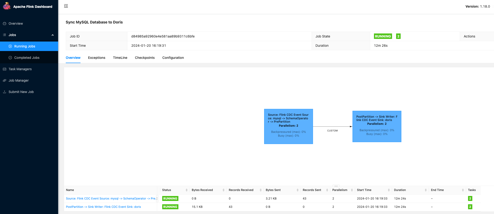

这里可以看到同步的数据条数及大小


查看doris的数据及建表情况

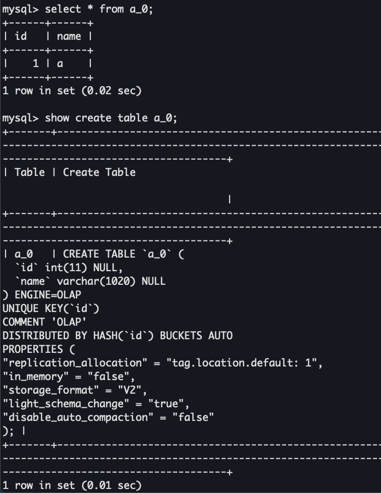

可以看到表被自动创建并且数据也同步过来了


**新增数据**

```sql
INSERT INTO `a_0` (`id`, `name`) VALUES (3, 'jack');
```

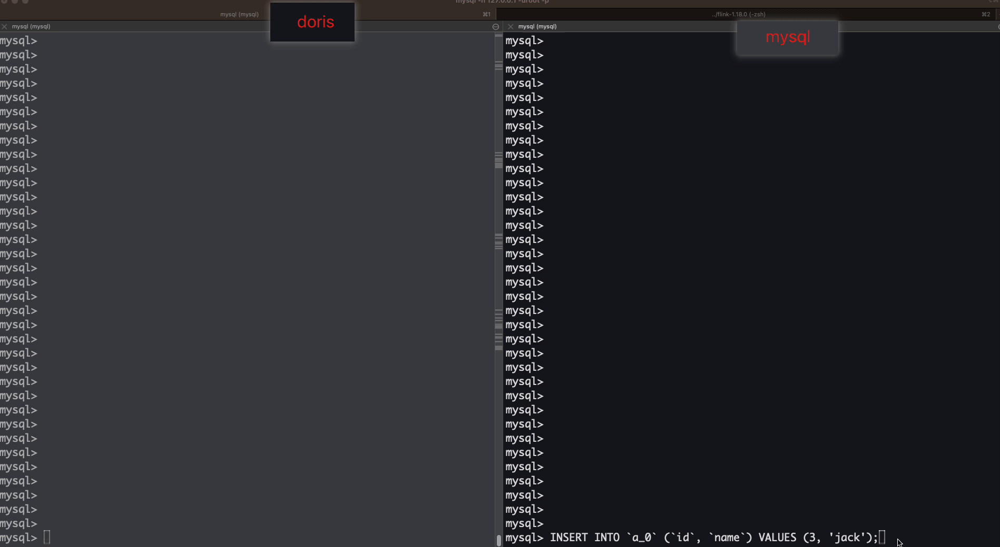


**更新数据**

```sql
update a_0 set name='tom' where id=3;
```

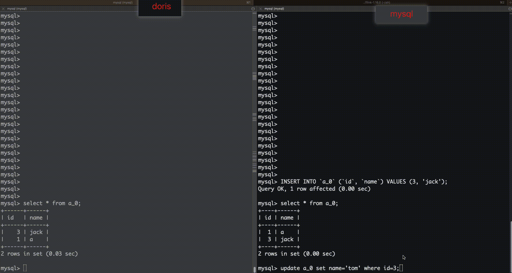


**删除数据**

```sql
delete from a_0 where id=1;
```

没成功同步(已咨询社区是1.2.2的bug,在1.2.3修复了,正常来说会同步)


**新增字段**

```sql
alter table a_0 add column age int;
```

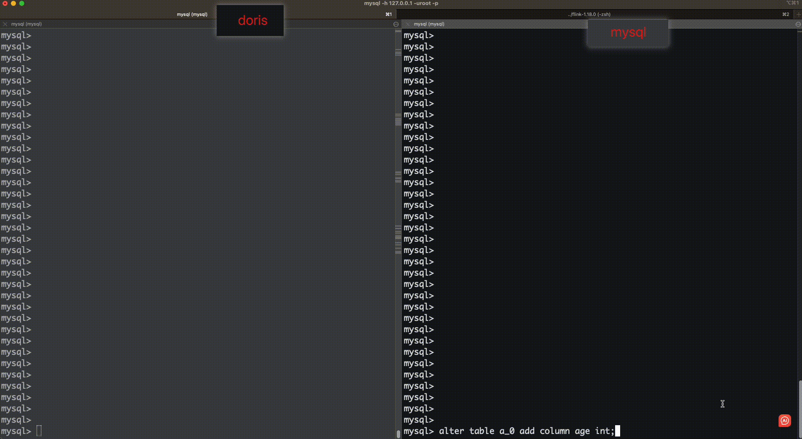

  
**修改字段**

```sql
# 修改名称
alter table a_0 change age age_range int;
# 修改字段类型
alter table a_0 modify column age_range varchar(100);
# 字段字段长度
alter table a_0 modify column age_range varchar(1200);
```

以上语句不会被同步


**删除字段**

```sql
alter table a_0 drop column age_range;
```

以上语句不会被同步


**删除表**

```sql
drop table a_0;
```

不会被同步


结论 : 

1.新增数据,新增字段,修改数据会被实时同步到doris

2.delete数据不会被同步(已咨询社区是1.2.2的bug,在1.2.3修复了,正常来说会同步)

3.修改字段名称,类型,长度不会被同步(可能有参数可以开启)

4.删除字段不会被同步

5.删除表不会被同步

## 路由变更
这里将使用flinkcdc3.0 新增的路由功能来实现分表合一的效果,而且也可以做到同步到doris的库名和表名换成自己想要的名称

将之前的mysql端数据清理,表重新建立


需求 : 

将mysql端doris_sync同步到doris的ods库中

a_0,a_1 合并到ods_a表

abc 同步到 ods_abc表

table_0,table_1同步到 ods_table表


任务配置 route.yaml

```yaml
################################################################################
# Description: Sync MySQL all tables to Doris
################################################################################
source:
  type: mysql
  hostname: localhost
  port: 3306
  username: root
  password: 12345678
  tables: doris_sync.\.*
  server-id: 5400-5404
  server-time-zone: Asia/Shanghai

sink:
  type: doris
  fenodes: 127.0.0.1:8031
  username: root
  password: ""
  table.create.properties.light_schema_change: true
  table.create.properties.replication_num: 1

route:
  - source-table: doris_sync.a_\.*
    sink-table: ods.ods_a
  - source-table: doris_sync.abc
    sink-table: ods.ods_abc
  - source-table: doris_sync.table_\.*
    sink-table: ods.ods_table

pipeline:
  name: Sync MySQL Database to Doris
  parallelism: 2
```


创建doris端ods库(不会自动创建库,必须手动创建)

```sql
create database ods;
```


将之前的任务停掉,启动这个任务

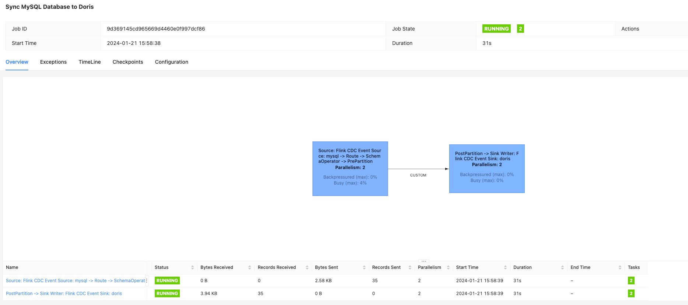

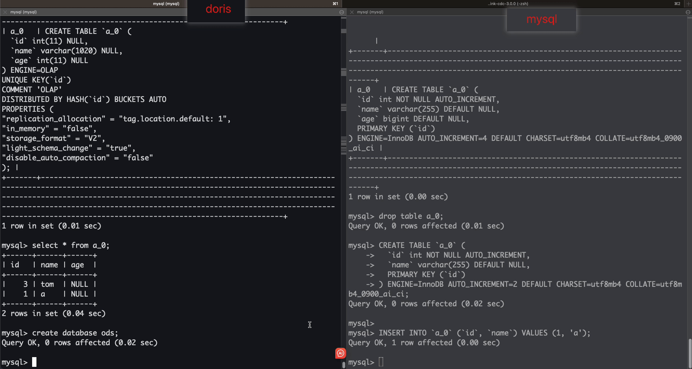

可以看到

1.多个分表在doris只创建了一个目标表

2.多个分表的数据都同步到了一个表中

非常棒的功能 👍👍👍


**测试一下新增一个分表是否会自动同步到目标表**

```sql
CREATE TABLE `a_2` (
  `id` int NOT NULL AUTO_INCREMENT,
  `name` varchar(255) DEFAULT NULL,
  PRIMARY KEY (`id`)
) ENGINE=InnoDB AUTO_INCREMENT=2 DEFAULT CHARSET=utf8mb4 COLLATE=utf8mb4_0900_ai_ci;

INSERT INTO `a_2` (`id`, `name`) VALUES (1000, 'a');
```

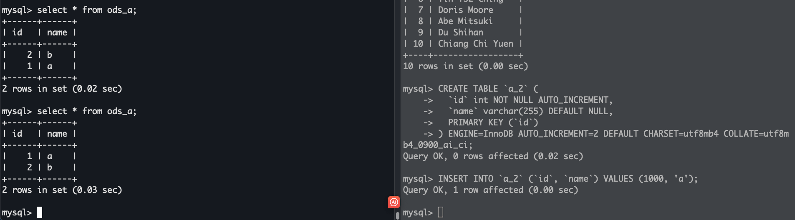

新增分表后,分表不会被自动同步


重启任务


重启后数据可以被正常同步


## 从checkpoint恢复任务并新增分表
先修改一下flink-conf.yaml,否则任务cancel的时候ck不会被保留,还需要修改一下ck存储的路径

```shell
# 在flink目录下创建一个路径存储ck
mkdir ckdata
```

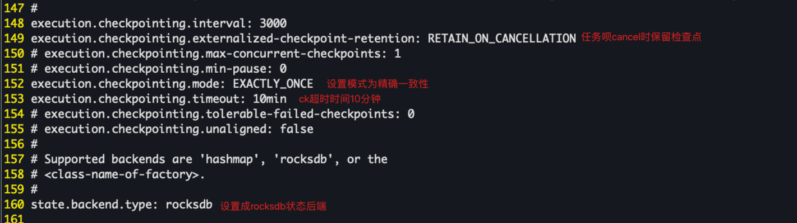

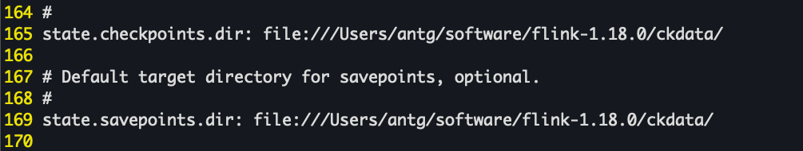


启动任务

```shell
bash bin/flink-cdc.sh route.yaml
```

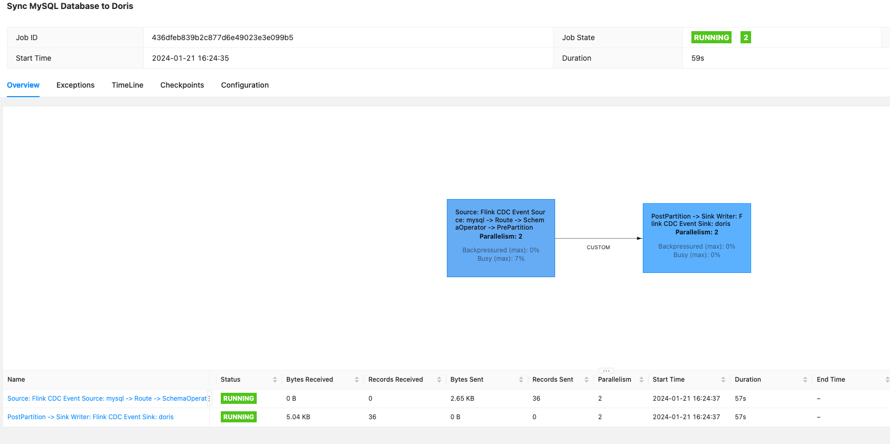

看一下ck是否正常存储


新增表,cancel任务,然后从ck处重启

```sql
CREATE TABLE `a_4` (
  `id` int NOT NULL AUTO_INCREMENT,
  `name` varchar(255) DEFAULT NULL,
  PRIMARY KEY (`id`)
) ENGINE=InnoDB AUTO_INCREMENT=2 DEFAULT CHARSET=utf8mb4 COLLATE=utf8mb4_0900_ai_ci;

INSERT INTO `a_4` (`id`, `name`) VALUES (1000000, 'a');
```


```yaml
################################################################################
# Description: Sync MySQL all tables to Doris
################################################################################
source:
  type: mysql
  hostname: localhost
  port: 3306
  username: root
  password: 12345678
  tables: doris_sync.\.*
  server-id: 5400-5404
  server-time-zone: Asia/Shanghai

sink:
  type: doris
  fenodes: 127.0.0.1:8031
  username: root
  password: ""
  table.create.properties.light_schema_change: true
  table.create.properties.replication_num: 1

route:
  - source-table: doris_sync.a_\.*
    sink-table: ods.ods_a
  - source-table: doris_sync.abc
    sink-table: ods.ods_abc
  - source-table: doris_sync.table_\.*
    sink-table: ods.ods_table

pipeline:
  name: Sync MySQL Database to Doris
  parallelism: 2
```


在flink-conf最后加上ck的重启路径

```shell
# 查看当前路径
pwd
/Users/antg/software/flink-1.18.0/flink-cdc-3.0.0

# 找到最新的ck存储路径
ll -rth ../ckdata
drwxr-xr-x@ 5 antg  staff   160B Jan 21 16:27 436dfeb839b2c877d6e49023e3e099b5
drwxr-xr-x@ 5 antg  staff   160B Jan 21 17:12 d519a3f930d9f410e048f63a883e1dce
drwxr-xr-x@ 5 antg  staff   160B Jan 21 18:59 b0ed22a804ad34336ab3e9b328d13257
drwxr-xr-x@ 5 antg  staff   160B Jan 21 19:01 394d7a89885bbd319e8ab92043283de9
drwxr-xr-x@ 5 antg  staff   160B Jan 21 19:05 1547d3cf60ed278ccd3787025bb4b5f6
drwxr-xr-x@ 5 antg  staff   160B Jan 21 19:07 51ff313e98fb9882f20f57bc697a8ae6
drwxr-xr-x@ 5 antg  staff   160B Jan 21 19:08 f10623b642135002499775274c078b9e
drwxr-xr-x@ 5 antg  staff   160B Jan 21 19:09 73b47091ca00547a5d8121474b3dbd79

ll ../ckdata/73b47091ca00547a5d8121474b3dbd79
drwxr-xr-x@ 3 antg  staff    96B Jan 21 19:09 chk-172
drwxr-xr-x@ 2 antg  staff    64B Jan 21 19:09 shared
drwxr-xr-x@ 2 antg  staff    64B Jan 21 19:09 taskowned

# 将ck路径加到flink-conf的最后一行
vim ../conf/flink-conf.yaml
execution.savepoint.path: file:///Users/antg/software/flink-1.18.0/ckdata/73b47091ca00547a5d8121474b3dbd79/chk-172

# 启动任务
bin/flink-cdc.sh route.yaml
```

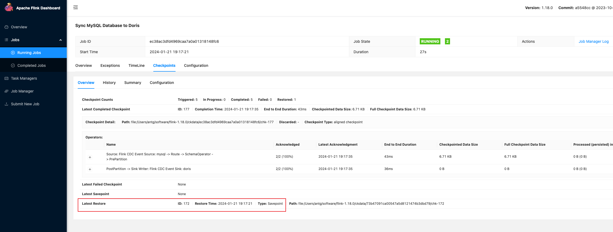

可以看到任务从检查点重启了

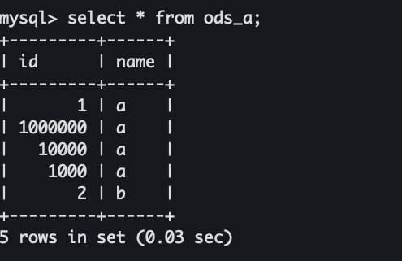

数据也正常同步


这里从ck重启是修改了flink-conf,但是感觉这样很不方便,尝试过在yaml的pipeline下加上这个属性,但是不起作用,其他位置也没找到加ck路径的地方,如果各位大神有其他好的方法欢迎评论区留言,也欢迎加我的个人微信一起交流各种技术.

# 参考
[基于 Flink CDC 3.0 构建 MySQL 到 Doris 的 Streaming ELT] : [https://ververica.github.io/flink-cdc-connectors/release-3.0/content/%E5%BF%AB%E9%80%9F%E4%B8%8A%E6%89%8B/mysql-doris-pipeline-tutorial-zh.html](https://ververica.github.io/flink-cdc-connectors/release-3.0/content/%E5%BF%AB%E9%80%9F%E4%B8%8A%E6%89%8B/mysql-doris-pipeline-tutorial-zh.html)

[vm.max_map_count参数详解] : [https://blog.csdn.net/a772304419/article/details/132585239](https://blog.csdn.net/a772304419/article/details/132585239)

