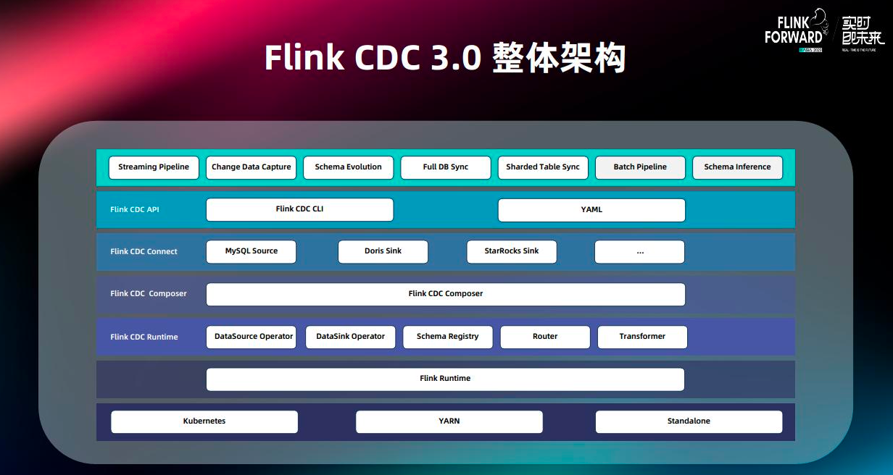
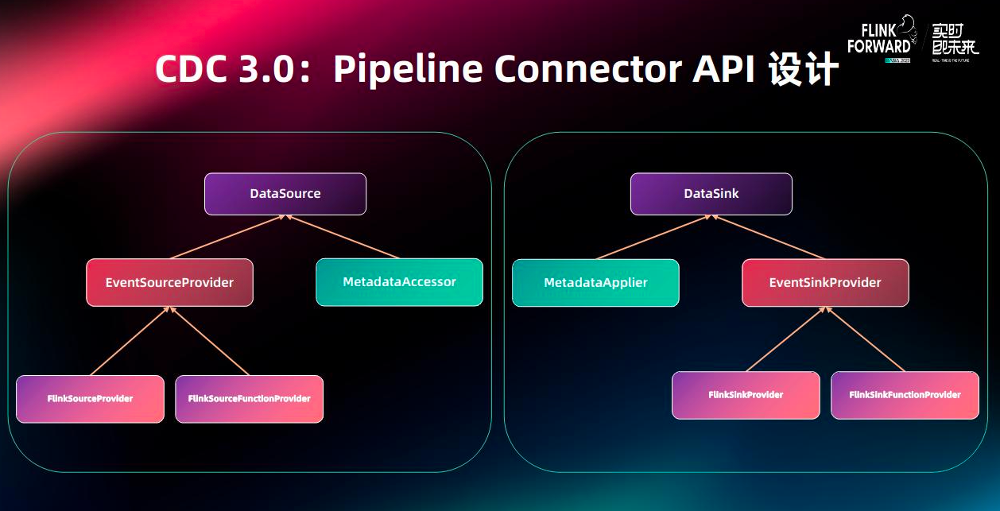
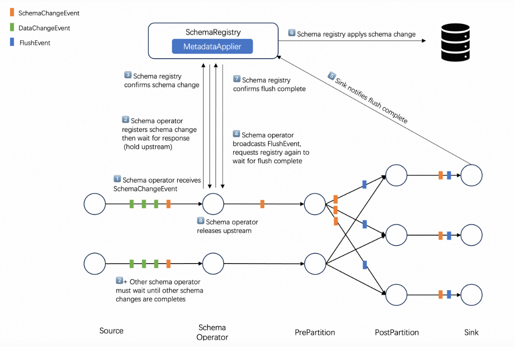
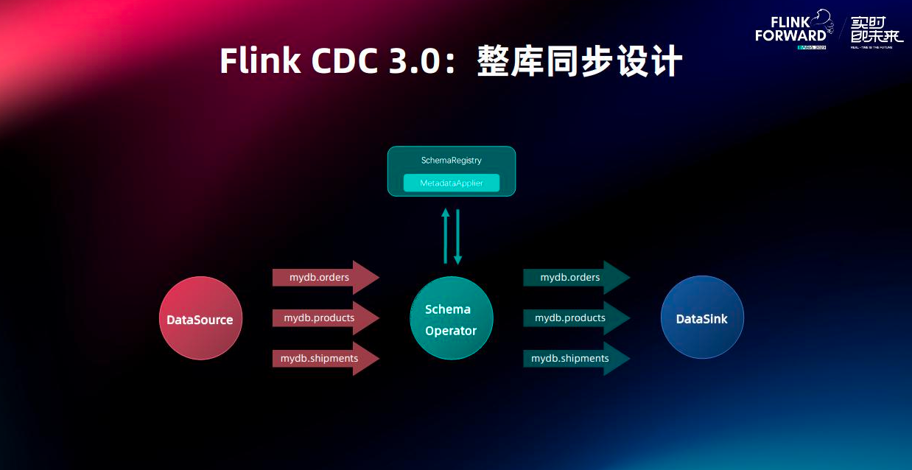
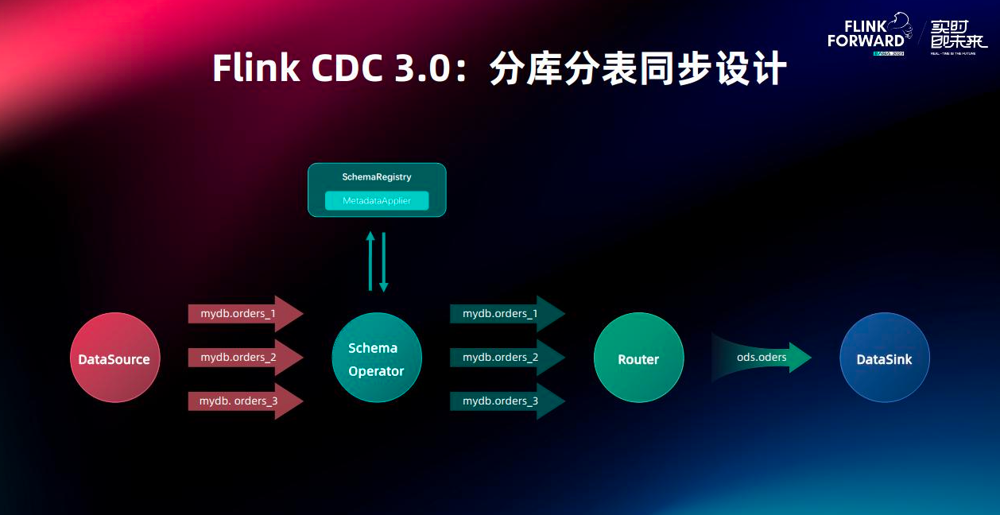
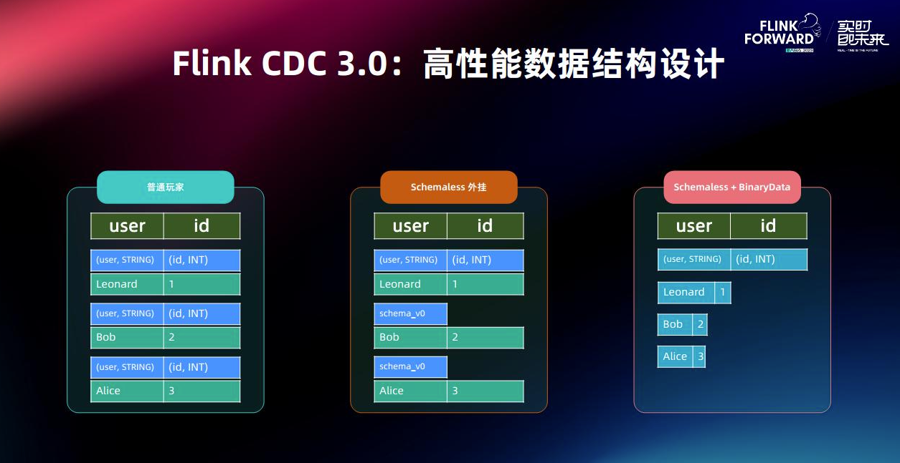

> 本文将会了解到flinkcdc3.0版本的架构设计,从一个宏观层面来学习flinkcdc3.0带来的新特性
>
> 这也是作者目前觉得学习一项技术的思路和方法,就是首先先把demo跑起来体验一下,然后整体了解一下架构设计,应用场景等,之后再去学习技术细节和源码,由浅入深的学习.
>
> 文中内容有误请多多包涵,欢迎评论区或者加笔者微信指教.
>


# 一.概述
Flink CDC(Change Data Caputre) 是一个**数据集成框架**,底层原理是实时捕获数据库的日志来进行数据同步(比如Mysql的binlog日志).

3.0版本具有里程碑意义,Flink CDC从捕获数据变更的数据源正式成为了**以Flink为基础的端到端流式ETL数据集成框架**

目前Flink CDC 3.0有如下功能及特点 : 

+ 全增量一体化同步
+ 无锁读取
+ 并行读取
+ 精确一致性语义
+ 支持表结构变更自动同步
+ 动态增表
+ 整库同步
+ 路由功能(可以实现分库分表合并的效果)
+ 分布式

# 二.整体架构设计
首先Flink CDC 的底层是基于Flink的,所以同步任务会运行在Flink集群,集群可以是k8s,或者是yarn,或者是standalone集群上,基于Flink CDC API提供的能力实现了流式管道,变更数据同步,Schema变更同步,整库同步,分表同步,批处理管道等功能.


Flink CDC 3.0架构一共分了4层

+**API**:**接口层**,面向终端用户,用户可以使用yaml文件来配置化生成数据同步作业,然后使用Flink CDC CLI提交作业.
+**Connect**:**连接层**,对接外部系统的连接器层,通过对现有的CDC Source进行封装实现对外部系统的读取和写入.
+**Composer**:**同步任务构建层**,将用户的同步任务翻译成Flink DataStream作业.
+**Runtime**:**运行时层**,根据数据同步场景高度定制Flink算子,实现schema变更,路由变换等高级功能.




# 三.核心设计解析
## 3.1 Pipeline Connector API 设计


管道连接器主要分成了两大部分,一个是负责读数据的DataSource,一个是负责写数据的DataSink

DataSource由负责构建Flink Source的**EventSourceProvicer**组件和提供元数据读取的**MatadataAccessor**组件组成.DataSource会读取外部系统的变更事件(变更的数据和schema),然后传递给下游算子.

DataSink由负责构建Flink Sink的**EventSinkProveider**组件和提供目标端元数据修改的**MetadataApplier**组件构成.

DataSink会将上游的变更数据写到目标端,并且会将schema变更同步到目标端.

## 3.2 Schema Evolution 设计
源端的schema变更是非常常见的事,在之前的cdc版本中没有schema自动同步的功能,所以需要手工处理,非常的浪费时间,在cdc3.0版本中实现了该功能,具体的逻辑如下图



首先事件分为三类,数据变更事件,Schema变更事件,Flush事件

1.Schema operator接收Schema变更消息.

2.当Schema operator接收到有Schema变更事件的时候会将整个**数据流暂停**然后向SchemaRegistry 发送变更的信息然后等待响应.

3.SchemaRegistry 确认schema的变更

4.Schema operator 广播FlushEvent,然后等待flush的完成,这一步是要将sink端缓存的事件先flush到目标端,因为这部分数据是schema变更之前的数据.

5.Sink端flush完成后会通知SchemaRegistry flush完成

6.SchemaRegistry通过MetadataApplier组件来将目标端的元数据修改

7.SchemaRegistry修改完元数据后会通知Schema operator flush事件完成,目标端的schema变更也完成了.

8.Schema operator 会恢复暂停的数据流,到此一个Schema的变更就完成了.


总体来说就是当cdc检测到有schema变更的时候,会先将数据流暂停,然后将之前sink端缓存的数据flush出去,然后修改目标端的元数据,修改完成后再恢复数据流.

## 3.3 整库同步设计
首先用户在配置文件中可以指定需要同步的整库,然后SchemaRegistry会在读取到新表后,自动在目标端建表,实现自动化整库同步.



## 3.4 分库分表同步设计
在后端开发中,因为考虑到数据的高效读写,所以会有将一个表拆成多个子表的设计,在数仓搭建中,经常会将这些分表合成一个表来处理.

Flink CDC 3.0的路由机制就可以实现分库分表的合并能力,也可以实现同步表的改名功能,demo如下

```yaml
   route:
     - source-table: app_db.order.*
       sink-table: ods_db.ods_orders
```




## 3.5 高性能数据结构设计
因为Flink是分布式框架,各个算子可能分布在不同的机器上,所以数据的流转过程中就免不了要序列化和反序列化.

为了降低这种序列化的开销,Flink CDC 3.0优化了之前的架构,引入了一套高性能的数据结构.


1.**变更数据和Schema信息分离**: 在之前设计中每条数据都带有schema信息,这就会增加额外的序列化成本,在3.0版本中发送变更数据前,source会先发送schema信息对其进行描述并有框架追踪,所以schema无需绑定在每条变更数据上,降低了序列化的成本.


2.**二进制存储格式**: 数据同步过程中使用二进制存储,只有在使用某个字段时(例如按主键进行分区)才会进行反序列化,进一步降低序列化成本.



# 四.一些思考
**使用经历**: 最早使用flinkcdc 1版本的时候还会遇到锁表问题,有时候dba就会找来一顿问,很快cdc2版本的无锁读就来了,当时我们很快就换上了2版本,但是当时我们同步还是得写stream api程序来同步表到doris,每次遇到加表或者schema变更就很头疼,得手动处理.现在3版本出来后对于用户来说体验一下子提升好几个档次,一个yaml文件直接生成一个同步任务,有条件的公司完全可以搞个可视化界面动态配置数据同步任务,然后生成yaml文件,然后再将任务提交.

**一些感悟**: 为什么一开始设计的时候就不能设计成这种配置化的呢?这是我今天在写这篇文章的时候的一个疑惑,但是突然想到了公司前辈说过的一些话,什么样的架构才是一个最好的架构呢,三个词 :**简单,合适,演进**那在cdc1.0的时候一定也是为了满足当时的业务场景而设计的,随着用户增多,业务场景增多,那么就架构就不合适了,就要演进来达到合适.不光是架构方面,我觉得在敲代码上也是,很多时候看到一堆si山代码,你觉得不合理,为什么不加注释,为什么写这么多if else等等,但是可能当时这部分代码就是最符合当时场景的代码,工期紧张,长时间加班等等.现在觉得这些代码不合适,那么就要演进来达到合适.(所以之后就**不要抱怨si山代码,阅读和修改si山代码也是一种能力,也不要抱怨架构的不合适,将不合适的架构修改成一套合适的架构也是一种能力**)

**一些奇思妙想**: 既然flinkcdc的同步任务可以做成配置化的,那么实时任务是否可以做成配置化呢?比如提前将各种算子写好,之后就是图形化界面的拖拉拽将算子组合,然后生成一个实时任务.开发人员仅需要开发各种配置化通用化的算子即可.

# 参考
[1] : [https://ververica.github.io/flink-cdc-connectors/release-3.0/](https://ververica.github.io/flink-cdc-connectors/release-3.0/)

[2] : [https://zhuanlan.zhihu.com/p/673607667](https://zhuanlan.zhihu.com/p/673607667) 

