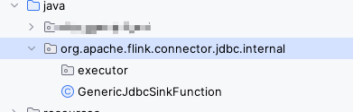
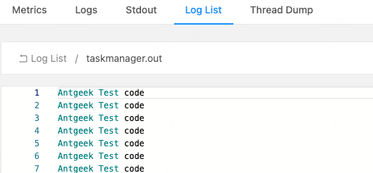

# 概述
最近业务要在代码中一些可能会出错的地方加一些告警,但是很多地方在源码中就将异常处理掉了,并不会被外部代码捕获到,所以对于这些异常就很难监控,如果说要修改源码的话就要把那个源码项目拉下来,然后打包再本地依赖引用一下,非常麻烦.这里将会介绍一个小技巧来优雅的修改源码.

来看一个报错

```java
ERROR org.apache.flink.connector.jdbc.internal.JdbcBatchingOutputFormat [] - JDBC executeBatch error, retry times = 0
com.mysql.cj.jdbc.exceptions.CommunicationsException: The last packet successfully received from the server was 136,714,911 milliseconds ago. The last packet sent successfully to the server was 136,714,912 milliseconds ago. is longer than the server configured value of 'wait_timeout'. You should consider either expiring and/or testing connection validity before use in your application, increasing the server configured values for client timeouts, or using the Connector/J connection property 'autoReconnect=true' to avoid this problem.
	at com.mysql.cj.jdbc.exceptions.SQLError.createCommunicationsException(SQLError.java:174) ~[flink-sql-connector-mysql-cdc-2.3.0.jar:2.3.0]
	at com.mysql.cj.jdbc.exceptions.SQLExceptionsMapping.translateException(SQLExceptionsMapping.java:64) ~[flink-sql-connector-mysql-cdc-2.3.0.jar:2.3.0]
	at com.mysql.cj.jdbc.ConnectionImpl.isReadOnly(ConnectionImpl.java:1403) ~[flink-sql-connector-mysql-cdc-2.3.0.jar:2.3.0]
	at com.mysql.cj.jdbc.ConnectionImpl.isReadOnly(ConnectionImpl.java:1388) ~[flink-sql-connector-mysql-cdc-2.3.0.jar:2.3.0]
	at com.mysql.cj.jdbc.ClientPreparedStatement.executeBatchInternal(ClientPreparedStatement.java:403) ~[flink-sql-connector-mysql-cdc-2.3.0.jar:2.3.0]
	at com.mysql.cj.jdbc.StatementImpl.executeBatch(StatementImpl.java:800) ~[flink-sql-connector-mysql-cdc-2.3.0.jar:2.3.0]
	at org.apache.flink.connector.jdbc.internal.executor.SimpleBatchStatementExecutor.executeBatch(SimpleBatchStatementExecutor.java:73) ~[hmb_realtime_flink_1.13.5-1.0-SNAPSHOT.jar:?]
	at org.apache.flink.connector.jdbc.internal.JdbcBatchingOutputFormat.attemptFlush(JdbcBatchingOutputFormat.java:213) ~[hmb_realtime_flink_1.13.5-1.0-SNAPSHOT.jar:?]
	at org.apache.flink.connector.jdbc.internal.JdbcBatchingOutputFormat.flush(JdbcBatchingOutputFormat.java:183) ~[hmb_realtime_flink_1.13.5-1.0-SNAPSHOT.jar:?]
	at org.apache.flink.connector.jdbc.internal.JdbcBatchingOutputFormat.lambda$open$0(JdbcBatchingOutputFormat.java:127) ~[hmb_realtime_flink_1.13.5-1.0-SNAPSHOT.jar:?]
	at java.util.concurrent.Executors$RunnableAdapter.call(Executors.java:511) [?:1.8.0_322]
	at java.util.concurrent.FutureTask.runAndReset(FutureTask.java:308) [?:1.8.0_322]
	at java.util.concurrent.ScheduledThreadPoolExecutor$ScheduledFutureTask.access$301(ScheduledThreadPoolExecutor.java:180) [?:1.8.0_322]
	at java.util.concurrent.ScheduledThreadPoolExecutor$ScheduledFutureTask.run(ScheduledThreadPoolExecutor.java:294) [?:1.8.0_322]
	at java.util.concurrent.ThreadPoolExecutor.runWorker(ThreadPoolExecutor.java:1149) [?:1.8.0_322]
	at java.util.concurrent.ThreadPoolExecutor$Worker.run(ThreadPoolExecutor.java:624) [?:1.8.0_322]
	at java.lang.Thread.run(Thread.java:750) [?:1.8.0_322]
```

这里没有一句是业务代码中的调用,都是源码层的

数据流是从mysql读取到数据后flink处理,最后通过flink 提供的JdbcSink.sink方法将数据回写到mysql结果表

这个报错已经在jdbc url中加入了各种参数去调整,但是还是会时而出现这个问题,可能会导致数据的不同步,所以要先监控起来,有问题了要先处理异常,之后再去解决这个问题.


# 操作过程
1.先得找到要修改的地方(此处省略,具体要看修改哪里的源码)

```java
org.apache.flink.connector.jdbc.internal.GenericJdbcSinkFunction
```


2.我们在数据包中直接创建一个相同的路径,放到java目录下,如下



然后创建一个相同的类名 GenericJdbcSinkFunction,并将源码的这个类中代码全部复制到这个新加的类中


3.修改源码

原来的代码

```java
public void invoke(T value, SinkFunction.Context context) throws IOException {
    this.outputFormat.writeRecord(value);
}
```

修改后的代码

```java
    public void invoke(T value, SinkFunction.Context context) throws IOException {
        try {
            this.outputFormat.writeRecord(value);
            System.out.println("Antgeek Test code");
        } catch (IOException e) {
            // 对源码报错进行告警
            AlertRobot.alert(e);
            throw new IOException(e);
        }
    }
```

4.启动项目查看效果



