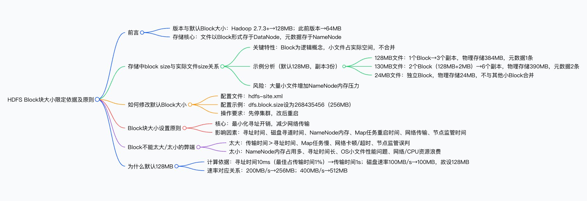

HDFS 以**块（Block）**为逻辑存储单元，**Hadoop 2.7.3 及以上版本默认 Block 大小为 128MB**（此前版本为 64MB），可通过修改`hdfs-site.xml`中`dfs.block.size`参数（需重启集群）调整；存储时 Block 为逻辑概念，小文件（如 24MB）仅占用实际大小空间且不与其他小 Block 合并，但大量小文件会增加**NameNode 内存开销**；Block 大小设置需遵循 “**最小化寻址开销、减少网络传输**” 原则，过大易导致传输时间过长、Map 任务缓慢及网络问题，过小则会增加寻址时间与 NameNode 负担；默认 128MB 是基于**平均寻址时间 10ms**（最佳为传输时间的 1%）和**磁盘传输速率 100MB/s**计算得出（10ms/0.01=1s，100MB/s×1s=100MB，取 128MB），不同磁盘速率对应不同最优值（如 200MB/s 对应 256MB）。

# 参考文章
[https://blog.csdn.net/bocai8058/article/details/119300121](https://blog.csdn.net/bocai8058/article/details/119300121)

